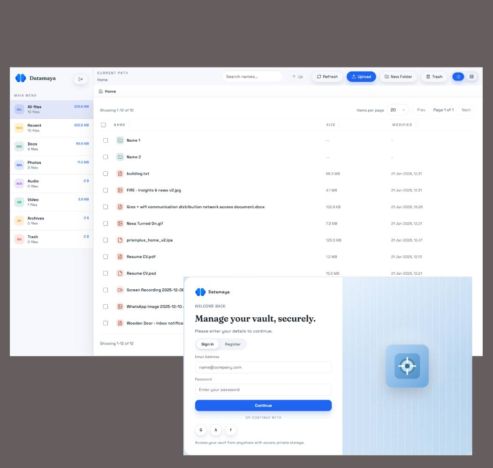

# datamaya

> Forked from [Bro File Manager](https://github.com/jetorbit/bro-file-manager) and enhanced with S3 support, advanced user management, file sharing, and a refreshed UI.

👨🏻 Modern file manager built with Bun + Hono + React. Now supports S3 storage, multi-user management, file sharing, and an updated, clean UI for browsing and managing files.

## Features
- Read/write file operations (upload, download, create, rename, delete/restore, copy/paste)
- Drag-and-drop upload across the app surface
- Batch downloads as zip or tar.gz, with large zips switching to store mode
- Search, filters, sorting, pagination, and a recent view for large directories
- Image preview popup and text preview (first 200 KB)
- Grid/thumbnail view toggle for browsing files and folders
- Built-in code editor (Ace) for common web files with syntax highlighting, fullscreen, and new-tab editing
- **S3 storage support** (optional, via config)
- **Advanced user management** (multi-user, roles, per-user roots)
- **File sharing** (generate shareable links)
- **Refreshed UI** for a modern, clean experience
- Audit logging for file actions
- Safe path normalization with symlink avoidance to prevent traversal

## Recent improvements
- Forked from Bro File Manager and renamed to **datamaya**
- S3 storage support for scalable cloud file management
- User management: roles, per-user roots, JSON config
- File sharing: generate and manage shareable links
- UI overhaul for a more modern and user-friendly experience
- Header logo and selection-aware toolbar with clear selection
- Restore the last visited folder on refresh
- Session cookies set `Secure` based on request scheme (supports HTTP in local Docker)
- Docker Compose host mounts can be overridden via `HOST_DATA_PATH` and `HOST_LOGS_PATH`
- Added grid view thumbnails and an in-app editor for HTML/PHP/JS/CSS/JSON/Markdown

## Requirements
- Bun >= 1.1

## Setup

```sh
bun install
```

## Configure
Copy `.env.example` to `.env` (Bun loads it automatically) and update values:

```sh
cp .env.example .env
```

```sh
ADMIN_PASSWORD=change-me           # legacy single-user mode
FILE_ROOT=.                        # optional, defaults to process cwd
SESSION_SECRET=change-me           # optional but recommended
PORT=3033                          # optional
ARCHIVE_LARGE_MB=100               # optional, zip switches to store mode at/above this size
```

Tip: avoid trailing spaces or hidden characters in `.env` values.

### Local users (recommended)
Define multiple users with roles and per-share roots via JSON:

```sh
USERS_FILE=/path/to/users.json
```

You can also inline it with `USERS_JSON` if you prefer:

```sh
USERS_JSON='[{"username":"admin","password":"change-me","role":"admin","root":"/"}]'
```

Example `users.json`:

```json
[
  { "username": "admin", "password": "change-me", "role": "admin", "root": "/" },
  { "username": "viewer", "passwordHash": "scrypt$<salt>$<hash>", "role": "read-only", "root": "/public" },
  { "username": "editor", "password": "edit-me", "role": "read-write", "root": "/team" }
]
```

Password hash format is `scrypt$<base64 salt>$<base64 hash>`. You can generate one with:

```sh
bun -e 'const { randomBytes, scryptSync } = require("crypto"); const salt = randomBytes(16); const hash = scryptSync(process.argv[1], salt, 32); console.log(`scrypt$${salt.toString("base64")}$${hash.toString("base64")}`);' "your-password"
```

### S3 storage (optional)
Enable S3 storage by setting `STORAGE_MODE=s3` (or just define `S3_BUCKET`).
When enabled, `FILE_ROOT` is ignored and user roots map to S3 prefixes.

```sh
STORAGE_MODE=s3                 # or omit and set S3_BUCKET
S3_BUCKET=your-bucket
AWS_REGION=ap-southeast-1       # or S3_REGION
AWS_ACCESS_KEY_ID=...           # optional if using IAM roles/instance profiles
AWS_SECRET_ACCESS_KEY=...       # optional if using IAM roles/instance profiles
AWS_SESSION_TOKEN=...           # optional (for temporary credentials)
S3_ROOT_PREFIX=brofm            # optional prefix inside the bucket
S3_ENDPOINT=https://...         # optional (for S3-compatible storage)
S3_FORCE_PATH_STYLE=true        # optional (for MinIO, etc)
```

## Build the frontend 👷🏻

```sh
bun run build
```

## Run 🏃🏼‍♂️

```sh
bun run start
```

Visit `http://localhost:3033` and sign in with your configured user.
If you are using `ADMIN_PASSWORD`, the default username is `admin` (or leave the username blank).

## Dev mode
Run the server and Vite (HMR) together:

```sh
bun run dev
```

The Vite dev server proxies `/api` to `http://localhost:3033` and supports hot reload.

## Deployment 🚀

### Docker
Build and run the container with Docker Compose:

```sh
docker compose up --build
```

The default compose file maps `3033:3033` and mounts `./data` into `/data` for `FILE_ROOT`.
Set `HOST_DATA_PATH` and `HOST_LOGS_PATH` in `.env` to override host mount paths without editing
`docker-compose.yml`. If you use `USERS_FILE`, mount it into the container and set the path
accordingly.

### PM2
Build the frontend once, then run the server with PM2:

```sh
bun run build
pm2 start "bun run start" --name bro-file-manager
pm2 save
```

Tip: run `pm2 startup` to auto-start on boot (follow the printed instructions).

## Versioning
This project follows SemVer. The current version is tracked in `package.json`.

## Changelog
See `CHANGELOG.md` for release notes and details on the fork and enhancements.

## Notes
- Symbolic links are skipped to avoid path escapes.
- Preview returns plain text only and is capped at 200 KB.
- Archive downloads stream `.zip` by default via system `zip` (use `format=targz` for `.tar.gz` via `tar`).
- Deletes move items into `/.trash`; restore requires the original parent path to exist.
- Audit logs are written to `./audit.log` by default (override with `AUDIT_LOG_PATH`).

Build with ❤️ from Jogja & Jetorbit
